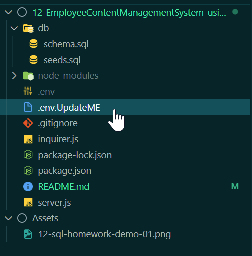
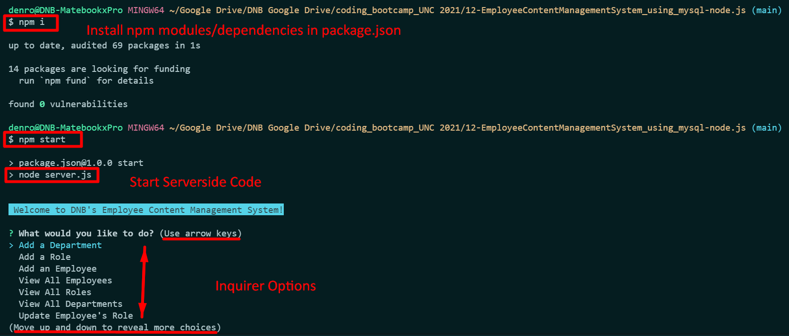
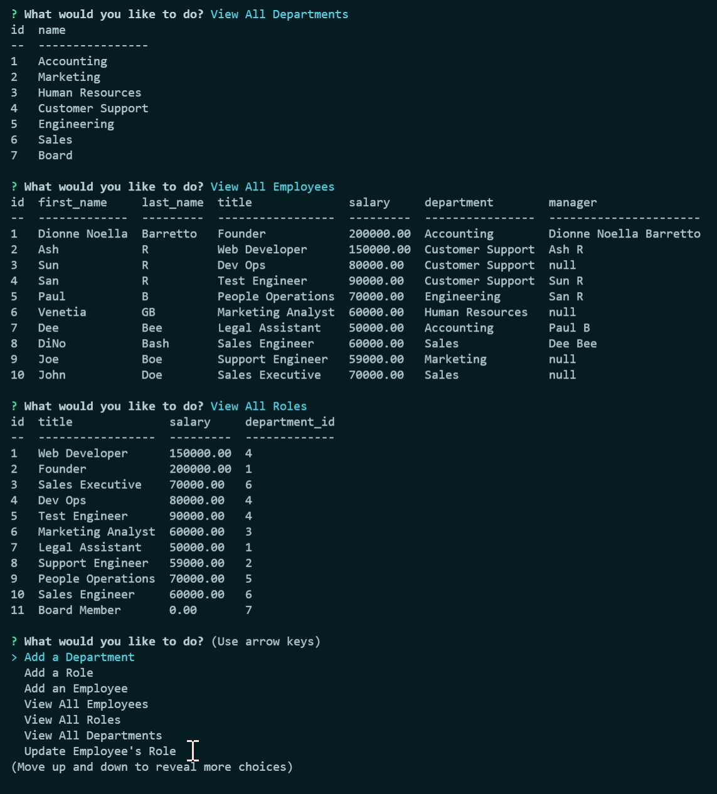
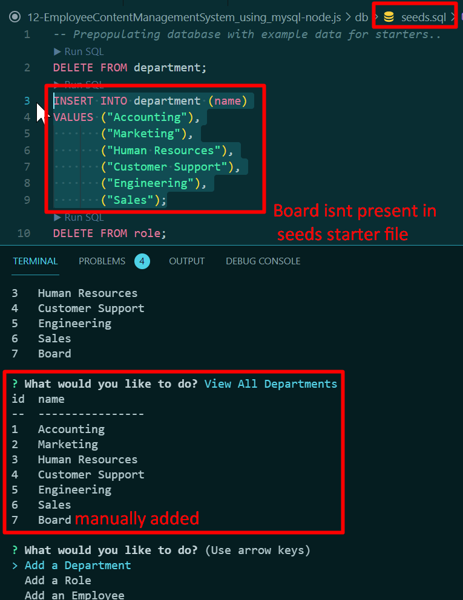

# 12-EmployeeContentManagementSystem_using_mysql-node.js
A command-line application from scratch to manage a company's employee database, using Node.js, Inquirer, and MySQL.

## Task

Developers frequently have to create interfaces (**content management systems (CMS)**) that allow non-developers to easily view and interact with information stored in databases. This week's assignment is to build a command-line application from scratch to manage a company's employee database, using Node.js, Inquirer, and MySQL.

## User Story

```md
AS A business owner
I WANT to be able to view and manage the departments, roles, and employees in my company
SO THAT I can organize and plan my business
```

## DNB's SOLUTION:
#### UNC Boot Camp Submission: 
🗂️ [Github Repository](https://github.com/DionneNoellaBarretto/12-EmployeeContentManagementSystem_using_mysql-node.js)

📰[ReadMe](https://dionnenoellabarretto.github.io/12-EmployeeContentManagementSystem_using_mysql-node.js/)

## Installation Instructions: 
To view the **content management systems (CMS)** interface, first run 'npm install' or 'npm i' after cloning this repository to your local system in order to install the npm package dependencies as specified in the 'package.json'. Prior to proceeding update the .envUpdateMe by editing your mysql username and password for the db & updating the file name to .env in the root folder itself. Next proceed to source the schema and seed files by connecting to the mysql db using your login credentials and then run this application using 'node server.js' or 'npm start' to plough through the subsequent command line prompts. 

## Acceptance Criteria

```md
GIVEN a command-line application that accepts user input
✓ WHEN I start the application THEN I am presented with the following options: view all departments, view all roles, view all employees, add a department, add a role, add an employee, and update an employee role
✓ WHEN I choose to view all departments THEN I am presented with a formatted table showing department names and department ids
✓ WHEN I choose to view all roles THEN I am presented with the job title, role id, the department that role belongs to, and the salary for that role
✓ WHEN I choose to view all employees THEN I am presented with a formatted table showing employee data, including employee ids, first names, last names, job titles, departments, salaries, and managers that the employees report to
✓ WHEN I choose to add a department THEN I am prompted to enter the name of the department and that department is added to the database
✓ WHEN I choose to add a role THEN I am prompted to enter the name, salary, and department for the role and that role is added to the database
✓ WHEN I choose to add an employee THEN I am prompted to enter the employee’s first name, last name, role, and manager, and that employee is added to the database
✓ WHEN I choose to update an employee role THEN I am prompted to select an employee to update and their new role and this information is updated in the database 
```
## Bonus Requirements

Try to add some additional functionality to your application, such as the ability to do the following:
```
❌ Update employee managers
✅ View employees by manager
    👉SELECT * FROM employee WHERE manager_id IS NOT NULL;
✅ View employees by department
    👉SELECT * FROM employee JOIN department ON department.id = employee.role_id WHERE role_id IS NOT NULL;
❌ Delete:roles
    Partially Implemented
✅ Delete:departments and employees
✅ View the total utilized budget of a department;in other words, the combined salaries of all employees in that department
    👉SELECT SUM(salary) AS "Total Salary" FROM employees;
```


## Mock-Up

[Video Link - Demonstration](https://drive.google.com/file/d/1hmCsqMy5L583B2Y2qswqoCN_mlVkbkLr/view) | [Bonus Exercise Video](https://drive.google.com/file/d/1VR3N3GaZWshDKILkHMVIvGCV5EM3bRNm/view)


DB Schema Mapping: 


File Structure / Update .env File:



Initialize Web App through Command Line Interface: 


Viewing Options: 


Department Table seed file doesn't show "Board" that was manually added by the user: 


## Grading Requirements

This homework is graded based on the following criteria:

### Deliverables: 10%
```
 ✅ Your GitHub repository containing your application code.
```
### Walk through Video: 27%
```
✅ A walk through video that demonstrates the functionality of the employee tracker must be submitted, and a link to the video should be included in your README file.
✅ The walk through video must show all of the technical acceptance criteria being met.
✅ The walk through video must demonstrate how a user would invoke the application from the command line.
✅ The walk through video must demonstrate a functional menu with the options outlined in the acceptance criteria.
```
### Technical Acceptance Criteria: 40%

* Satisfies all of the preceding acceptance criteria plus the following:
```
✅ Uses the [Inquirer package](https://www.npmjs.com/package/inquirer).
✅ Uses the [MySQL2 package](https://www.npmjs.com/package/mysql2) to connect to a MySQL database.
✅Uses the [console.table package](https://www.npmjs.com/package/console.table) to print MySQL rows to the console.
```
* Follows the table schema outlined in the homework instructions.

### Repository Quality: 13%
```
✅ Repository has a unique name.
✅ Repository follows best practices for file structure and naming conventions.
✅ Repository follows best practices for class/id naming conventions, indentation, quality comments, etc.
✅ Repository contains multiple descriptive commit messages.
✅ Repository contains quality README file with description, screenshot, and link to deployed application.
```

### Application Quality 10%

✅ The application user experience is intuitive and easy to navigate.

### Bonus

Fulfilling any of the following can add up to 20 points to your grade. Note that the highest grade you can achieve is still 100:
```
❌ Application allows users to update employee managers (2 points).
✅ Application allows users to view employees by manager (2 points).
❌ Application allows users to view employees by department (2 points).
❌ Application allows users to delete departments, roles, and employees (2 points).
✅ Application allows users to delete departments, and employees (2 points for each).
❌ Application allows users to view the total utilized budget of a department in other words, the combined salaries of all employees in that department (8 points).
```